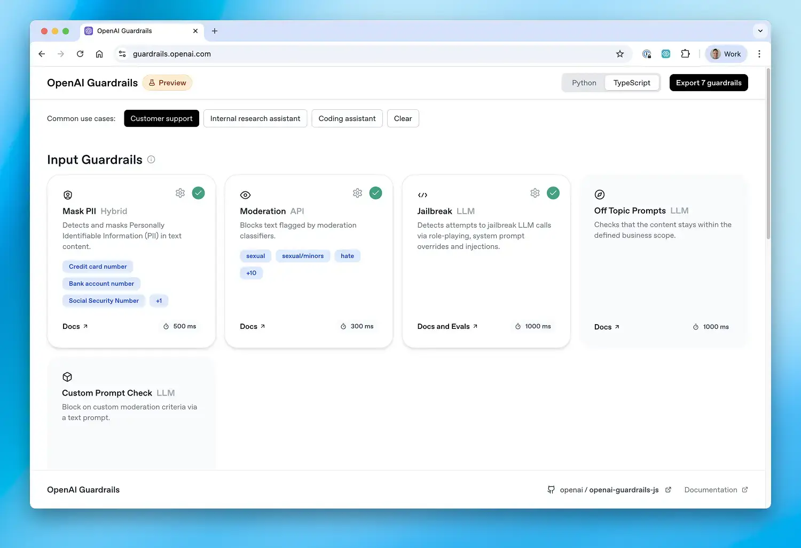

# OpenAI Guardrails: TypeScript (Preview)

Add configurable input and output checks to your OpenAI applications. Guardrails wraps the OpenAI JavaScript/TypeScript client and supports `responses.create()` and `chat.completions.create()`, with integrations for Azure OpenAI and the Agents SDK.

[Documentation](https://openai.github.io/openai-guardrails-js/) · [Configuration wizard](https://guardrails.openai.com/) · [Examples](examples/) · [Migration guide](docs/sdk_migration.md)

[](https://guardrails.openai.com/)

## Quickstart

Requires Node.js 22.13+ on the 22.x release line, or Node.js 24+. Set `OPENAI_API_KEY` in your environment, then install:

```bash
npm install @openai/guardrails
```

Save this as `guardrails-example.ts`. It checks generated text for the selected moderation categories before returning it:

```typescript
import { GuardrailsOpenAI, GuardrailTripwireTriggered } from '@openai/guardrails';

async function main() {
  const client = await GuardrailsOpenAI.create({
    version: 1,
    output: {
      version: 1,
      guardrails: [{ name: 'Moderation', config: { categories: ['hate', 'violence'] } }],
    },
  });

  try {
    const response = await client.responses.create({
      model: 'gpt-5',
      input: 'Hello world',
    });
    console.log(response.output_text);
  } catch (error) {
    if (error instanceof GuardrailTripwireTriggered) {
      console.log('Response blocked by a guardrail.');
    } else {
      throw error;
    }
  }
}

main().catch(() => {
  console.error('Request failed. Check your API credentials and configuration.');
  process.exitCode = 1;
});
```

Run it with:

```bash
npx tsx guardrails-example.ts
```

You can also pass an exported configuration file path to `GuardrailsOpenAI.create()`. Use the [configuration wizard](https://guardrails.openai.com/) to choose checks and the [quickstart guide](docs/quickstart.md) to learn about preflight, input, and output stages. See [tripwire handling](docs/tripwires.md) for handling blocked requests and guardrail execution errors.

## Integrations and checks

- [Agents SDK](docs/agents_sdk_integration.md): create an agent with `await GuardrailAgent.create(...)`.
- [Azure OpenAI](examples/basic/azure_example.ts) and [local models](examples/basic/local_model.ts).
- [Streaming](docs/streaming_output.md) and [inspecting results without raising tripwires](examples/basic/suppress_tripwire.ts).

Built-in checks include [Moderation](docs/ref/checks/moderation.md), [Contains PII](docs/ref/checks/pii.md), [URL Filter](docs/ref/checks/urls.md), [Hallucination Detection](docs/ref/checks/hallucination_detection.md), [Jailbreak](docs/ref/checks/jailbreak.md), [Prompt Injection Detection](docs/ref/checks/prompt_injection_detection.md), [Off Topic Prompts](docs/ref/checks/off_topic_prompts.md), and [Custom Prompt Check](docs/ref/checks/custom_prompt_check.md). Each reference explains its configuration and prerequisites.

## Evaluations

Measure guardrail precision, recall, and F1 against labeled datasets. Export a configuration as `guardrails_config.json` from the [wizard](https://guardrails.openai.com/) and create `data.jsonl` with one JSON object per line. Labels must match the guardrail names in your configuration; for a Moderation-only configuration:

```jsonl
{"id":"sample_1","data":"Hello world","expected_triggers":{"Moderation":false}}
```

Run the installed CLI:

```bash
npx --no-install guardrails eval --config-path guardrails_config.json --dataset-path data.jsonl
```

See the [evaluation guide](docs/evals.md) for dataset requirements, benchmarking, and multi-turn evaluation, or the [programmatic API](docs/ref/eval/guardrail_evals.md).

## Local development

```bash
git clone https://github.com/openai/openai-guardrails-js.git
cd openai-guardrails-js
npm ci
npm run build
npm run test:run
npm run lint
npm run docs:check
```

With `OPENAI_API_KEY` set, run a repository example:

```bash
npx tsx examples/basic/hello_world.ts
```

See the [examples guide](examples/README.md) for more examples and their prerequisites, and the [release guide](.changeset/README.md) for publishing.

## License

[MIT](LICENSE).

## Disclaimers

Please note that Guardrails may use Third-Party Services such as the [Presidio open-source framework](https://github.com/microsoft/presidio), which are subject to their own terms and conditions and are not developed or verified by OpenAI.  For more information on configuring guardrails, please visit: [guardrails.openai.com](https://guardrails.openai.com/)

Developers are responsible for implementing appropriate safeguards to prevent storage or misuse of sensitive or prohibited content (including but not limited to personal data, child sexual abuse material, or other illegal content). OpenAI disclaims liability for any logging or retention of such content by developers. Developers must ensure their systems comply with all applicable data protection and content safety laws, and should avoid persisting any blocked content generated or intercepted by Guardrails. Guardrails calls paid OpenAI APIs, and developers are responsible for associated charges.
